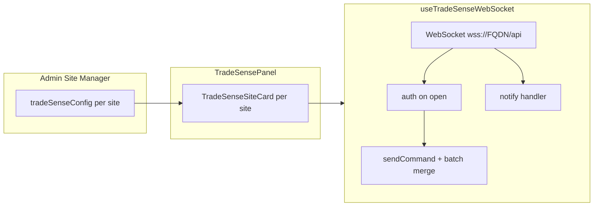

# TradeSense WBA API – Implementation vs Document

**API reference:** TradeSense WBA 10.0.14  
**Document path:** `C:\Projects\VoiceBot\backend-dotnet\External\TradeSense WBA 10.0.14 - Unknown.txt`  
**Client hook:** `project/src/hooks/useTradeSenseWebSocket.ts`  
**UI:** `project/src/components/advanced/TradeSensePanel.tsx`  
**Per-site config:** `project/src/components/admin/SiteManager.tsx` → `TradeSenseConfig` in `project/src/types/index.ts`

Connect to `wss://<TradeSenseFQDN>/api`. Authentication via `auth` with API token from Assure WBA Client Manager is mandatory before other commands.

---

## Command Coverage Summary

| Command | WBA 10.0.14 | `useTradeSenseWebSocket` | UI / auto-fetch |
|---------|---------------|--------------------------|-----------------|
| `auth` | Mandatory on connect | ✅ On `onopen` + `auth()` | Per-site Connect |
| `get_zones` | Fetch data | ✅ `getZones()` | Button + `autoGetZones` |
| `get_turrets` | Fetch data | ✅ `runCommand('get_turrets')` | `autoGetTurrets` only |
| `get_users` | Fetch data | ✅ `runCommand('get_users')` | `autoGetUsers` only |
| `get_events` | Fetch data (ID/datetime limits) | ✅ `runCommand('get_events')` | `autoGetEvents` only |
| `get_calls` | Fetch data (filters) | ✅ `runCommand('get_calls')` | `autoGetCalls` only |
| `get_version` | Fetch data | ✅ `runCommand('get_version')` | `autoGetVersion` only |
| `get_tpos` | Fetch data | ✅ `getTpos()` | Button + `autoGetTpos` |
| `get_lines` | Fetch data | ✅ `runCommand('get_lines')` | `autoGetLines` only |
| `get_shared_profiles` | Fetch data | ⚠️ Via `runCommand` only | No auto option |
| `get_health` | Provisioning status | ✅ `runCommand('get_health')` | `autoGetHealth` |
| `get_health_api_report` | Full health report | ✅ `getHealthApiReport()` | Button + `autoGetHealthApiReport` (default on) |
| `subscribe` | Notifications | ✅ `subscribe(category)` | Sub buttons + `autoSubscribeToEvents` |
| `unsubscribe` | Notifications | ✅ `unsubscribe(category)` | Sub/Unsub toggles |
| `service_ctd` | Click-to-dial / call control | ❌ Not implemented | — |
| Remote logon/logoff | Turret control | ❌ Not implemented | — |

**Categories:** `calls`, `presences`, `alerts` (per document).

---

## Protocol & Message Handling

| Feature | Document | Implementation |
|---------|----------|----------------|
| Command envelope | `{ command, command_ref, args }` | ✅ All outbound commands |
| Response | `{ command: "response", success, data, error? }` | ✅ Handled; also accepts `command: "return"` |
| Notify | `{ command: "notify", data: { category, events } }` | ✅ Stored (last 100 batches) |
| Batched responses | `current_batch`, `last_batch` on response/env/data | ✅ `batchMetaFromMessage` + `mergeBatchPayload` |
| Optional list filters | `search`, `operator`, `limit` on zones/tpos/etc. | ⚠️ Not wrapped; pass via `runCommand(name, args)` |
| Alerts in health report | `args: { include: "alerts" }` | ✅ `getHealthApiReport(true)` — UI button uses `false` only |
| `server notification` | Re-auth before session expiry | ✅ Re-sends `auth` on `authentication expiry` |
| Session re-`auth` | Required when timeout/gracetime configured | ✅ Automatic; `sessionNotice` in UI while refreshing |
| Session expired | `command_ref: "Session expired"` | ✅ Clears auth; `onSessionExpired` callback / toast |
| WebSocket ping | Server ping frames (configurable interval) | ✅ Browser WebSocket handles ping/pong |
| Errors | `error.code`, `message`, `reason` | ✅ Sets `lastError`; failed commands resolve handler with `null` |

---

## 1. Authentication

### Document

```json
{ "command": "auth", "command_ref": "...", "args": { "token": "TOKEN" } }
```

Mandatory before other commands. Re-authentication may be required when `application.global.wba.auth.timeout` / `gracetime` are set; server sends `server notification` before expiry.

### Implementation

- Sends `auth` immediately on WebSocket `onopen` with site token.
- Sets `isAuthenticated` when auth `command_ref` response has `success: true`.
- `auth(tok)` available for manual re-auth (not wired to server notifications).
- Tokens persisted in `localStorage` key `tradeSenseWebSocketConfig` (global fallback) and per-site `tradeSenseConfig` in site data.

### Implementation (session refresh)

- On `command: "server notification"` with `command_ref` containing `authentication expir`, client re-sends `auth` with the same token (guarded by `reauthInFlightRef`).
- On `Session expired`, sets `isAuthenticated: false` and invokes `onSessionExpired` (TradeSense panel shows toast).
- `sessionNotice` state shows “Refreshing TradeSense session…” during re-auth.

---

## 2. Get Zones

### Document

```json
{ "command": "get_zones", "command_ref": "...", "args": {} }
```

Optional: `{ search, operator, limit }`. Response: `data.zones[]` with `id`, `name`, `locationCountryCode`, `locationRegion`, `locationCity`, `callPrefix`.

### Implementation

- `getZones()` — empty args.
- Types: `TradeSenseZone` in hook file.

---

## 3. Get TPOs

### Document

```json
{ "command": "get_tpos", "command_ref": "...", "args": {} }
```

Response: `data.tpos[]` with `name`, `alive`, `tssVersion`, `currentState`, `ipAddress`, `tpoDnsName`, `recordingServerEnabled`, `zone`, `clusterName`, `recordingServer`, etc.

### Implementation

- `getTpos()` — empty args.
- Types: `TradeSenseTPO`.

---

## 4. Get Health API Report

### Document

```json
{ "command": "get_health_api_report", "args": {} }
{ "command": "get_health_api_report", "args": { "include": "alerts" } }
```

Large nested report: zones, clusters, TPOs, turrets, voice recorders, PBX, `tradesenseNodeHealth`, optional batched alerts.

### Implementation

- `getHealthApiReport(includeAlerts?)` — correct args.
- `TradeSenseHealthReport` type with index signature for extra fields.
- Batched alert payloads merged via batch logic.

---

## 5. Get Health (provisioning)

### Document

```json
{ "command": "get_health", "command_ref": "..." }
```

Returns `data.provisioning` (assure/gecko completion status) — distinct from `get_health_api_report`.

### Implementation

- `runCommand('get_health')` on auto-connect when `autoGetHealth` enabled.
- No dedicated state field or panel section (result not displayed unless logged).

---

## 6. Other Fetch Commands (auto-only)

Invoked on first authenticated connect when enabled in Site Manager:

| Command | Auto flag |
|---------|-----------|
| `get_turrets` | `autoGetTurrets` |
| `get_users` | `autoGetUsers` |
| `get_events` | `autoGetEvents` |
| `get_calls` | `autoGetCalls` |
| `get_version` | `autoGetVersion` |
| `get_lines` | `autoGetLines` |

Errors swallowed in panel `useEffect` (`.catch(() => {})`). No manual buttons for these in the panel UI.

---

## 7. Subscribe / Unsubscribe

### Document

```json
{ "command": "subscribe", "args": { "category": "calls" } }
```

Response: `data: { category, last_id }`. Notifications: `{ command: "notify", data: { category, events: [...] } }`.

### Implementation

- `subscribe` / `unsubscribe` for `calls` | `presences` | `alerts`.
- Panel toggle buttons per category.
- `autoSubscribeToEvents` subscribes all three on connect (default **on** in `defaultTradeSenseConfig`).

---

## 8. Not Implemented (WBA 10.0.14)

| Area | Commands / behavior |
|------|---------------------|
| Call services | `service_ctd` (dial, hold, resume, transfer, conference, etc.) |
| Turret control | Remote logon/logoff |
| Shared profiles | `get_shared_profiles` (no auto flag; use `runCommand`) |
| WBA Client Manager | UI status cases (session expiry display) — Assure-side only |
| Missed events replay | After subscribe `last_id` mismatch — use `get_events` (not automated) |

---

## Architecture in LogSentinel



- **Per-site mode:** `skipAutoConnect: true`; user clicks **Connect** per site card.
- **Auto-fetch:** Runs once per auth session (`hasRunAutoRef`).
- **Auto-reconnect:** Configurable per site (`autoReconnect`, default true); max 10 attempts, 3s interval.
- **Debug logging:** Optional write-all raw WS messages via `wsLogToFile.ts` (`tradeSenseLogConfig` in localStorage).

---

## Files

| File | Purpose |
|------|---------|
| `project/src/hooks/useTradeSenseWebSocket.ts` | WBA client: auth, commands, batching, notify, reconnect |
| `project/src/components/advanced/TradeSensePanel.tsx` | Multi-site UI, connect, fetch, subscribe, log-to-file |
| `project/src/components/admin/SiteManager.tsx` | Enable TradeSense, URL/token, auto-fetch checkboxes |
| `project/src/types/index.ts` | `TradeSenseConfig`, `Site` |
| `project/src/utils/wsLogToFile.ts` | WebSocket message file logging |
| `project/src/hooks/useBTSystemsWebSocket.ts` | Legacy/generic BT push WebSocket (not WBA command protocol) |
| `project/src/components/advanced/BTSystemsPanel.tsx` | Passive BT health/status UI |

---

## Usage

1. **Admin → Site Manager:** Enable TradeSense WBA, set `wss://<FQDN>/api` and API token; choose auto-fetch options (defaults: health API report + subscribe + reconnect).
2. **Teal Radio button** (header FAB): Open TradeSense panel.
3. Per site: **Connect** → wait for **Authenticated**.
4. Use **Get Zones**, **Get TPOs**, **Health Report**, or **Sub/Unsub** for event categories.
5. Optional: enable **Log WebSocket messages to file** for audit/debug.

---

## Testing Checklist

- [ ] Connect with valid token → `Authenticated`
- [ ] Invalid token → `lastError` shows auth failure reason
- [ ] `get_zones` / `get_tpos` populate lists
- [ ] `get_health_api_report` returns JSON in panel
- [ ] `get_health_api_report` with `include: "alerts"` if large batched payload
- [ ] Subscribe `calls` → `notify` events appear
- [ ] Disconnect / auto-reconnect behavior with checkbox off vs on
- [ ] Multiple sites with different FQDNs connect independently
- [ ] Re-auth: server sends `authentication expiry` notification → session refreshes without disconnect
- [ ] Session expired after gracetime → toast and requires Connect
